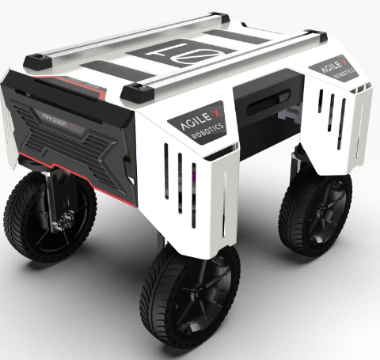
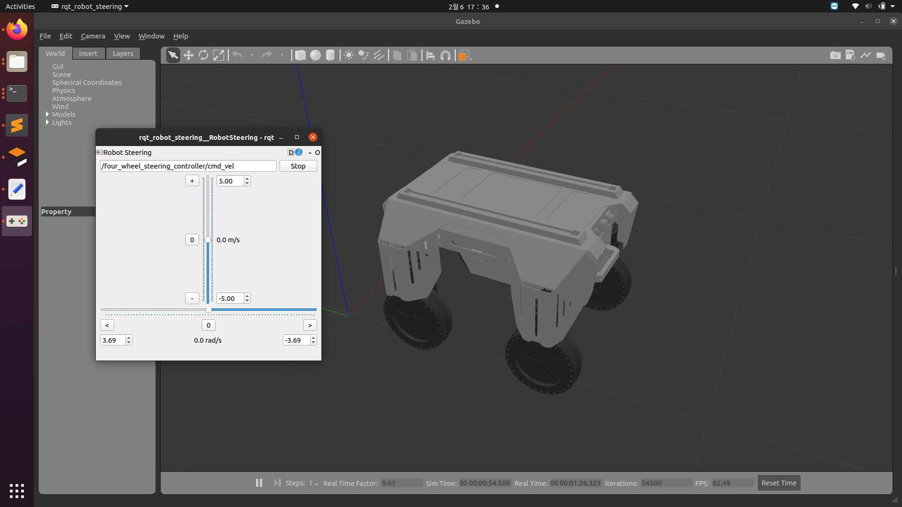

# Ranger-Mini

## Introduction
Minimal package to control the Agilex Ranger Mini robot using the computer and the keyboard.
<p align="center">
  
</p> <br /> <br />


Also, this package provides the Gazebo environment of the robot.



## Requirements
```
sudo apt-get install libasio-dev
sudo apt install can-utils
sudo apt install ros-noetic-teleop-twist-keyboard
```

## Installation

```
mkdir ~/ranger_mini && cd ~/ranger_mini
git clone https://github.com/pvela2017/Ranger-Mini-Project.git

# install the ascent library at first
cd src/ranger_ros/ranger_base/ascent
mkdir -p build && cd build && cmake -DBUILD_TESTING=OFF .. && sudo make install

cd ~/ranger_mini
catkin_make 
```
### Ugv_sdk test
1. Enable gs_usb kernel module
    ```
    sudo modprobe gs_usb
    ```
2. Bringup can device
   ```
   sudo ip link set can0 up type can bitrate 500000
   ```
3. If no error occured during the previous steps, you should be able to see the can device now by using command
   ```
   ifconfig -a
   ```  
4. Testing command
    ```
    # receiving data from can0
    candump can0
    # send data to can0
    cansend can0 001#1122334455667788
    ```

## Run
Inicialization
```
cd ~/ranger_mini
source devel/setup.bash
roslaunch ranger_bringup ranger_minimal.launch
```

Use the keyboard to control (Open new terminal)
```
cd ~/ranger_mini
source devel/setup.bash
roslaunch ranger_bringup ranger_teleop_keyboard.launch
```

## Gazebo
Run the start file of ranger_mini to visualize the model in Rviz
```
roslaunch ranger_mini display_xacro.launch 
```

Start the simulation environment of ranger_mini, move the sliding bar to control the robot movements
```
roslaunch ranger_mini_gazebo ranger_mini_empty_world.launch
```

More info:
https://github.com/agilexrobotics/ranger_ros
